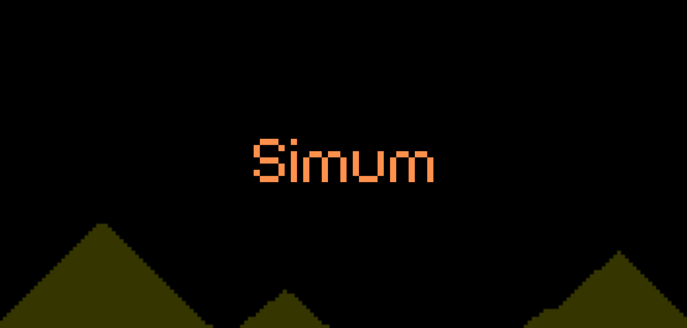

# Simum

### A simulation for various elements.

**Simum** (spawned from sand-simulation) is a simulation that is designed to see the properties of various elements, types, gases and such.

The aim is to get a realistic representation of how how different elements behave when interacting with the eachother and itself. The idea came after seeing a game called [Noita](https://store.steampowered.com/app/881100/Noita/).
